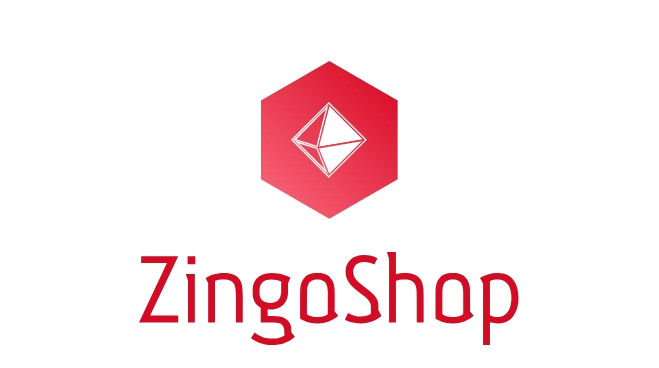

# ZingoShop Backend: Powering a Seamless E-commerce Experience 🛍️

 
    

Welcome to the backend repository for ZingoShop, a comprehensive single-vendor e-commerce solution. This powerful backend, built with PHP and MySQL, provides a robust and scalable foundation for the entire ZingoShop platform. It seamlessly interacts with the frontend applications (user app, admin app, and delivery app) through a well-defined RESTful API. 

## Table of Contents

- [Project Overview](#project-overview)
- [Features](#features)
- [Architecture](#architecture)
- [Technologies Used](#technologies-used)
- [API Documentation](#api-documentation) 
- [Code Organization](#code-organization)
- [Installation and Setup](#installation-and-setup)
- [Future Enhancements](#future-enhancements)
- [Contribution Guidelines](#contribution-guidelines) 
- [License](#license)

## Project Overview

The ZingoShop backend plays a crucial role in managing the core e-commerce logic, data, and interactions for the entire platform. It provides a secure and efficient system for handling:

- User authentication and management.
- Product catalog and inventory.
- Shopping cart operations.
- Order processing and tracking.
- Address management.
- Coupon codes and discounts.
- Push notifications for order updates and promotions.
- Admin functionalities for managing the platform.
- Delivery personnel functionalities for order fulfillment.

## Features

- **User Management:** The backend securely handles user registration, login, account activation via email verification, and password reset with email verification. 
- **Product Management:** Provides robust endpoints for managing the product catalog, including creating, retrieving, updating, and deleting products and categories. 
- **Order Management:**  Enables efficient order processing, from creation and status updates to tracking, history management, and user ratings.
- **Address Management:**  Allows users to store, update, and delete their shipping addresses for accurate and convenient deliveries.
- **Cart Management:** Provides the functionality for users to add and manage items in their shopping carts, including updating quantities and removing items.
- **Coupon Management:** Validates coupon codes, applies discounts to orders, and manages coupon usage limits.
- **Notification Management:**  Utilizes Firebase Cloud Messaging (FCM) to send real-time push notifications to users, keeping them informed about order updates, promotions, and other relevant events. 
- **Admin Functionality:** The backend offers a secure set of endpoints for admin actions, including product and category management, order processing and fulfillment, and configuration of app-wide settings.
- **Delivery Functionality:** Provides dedicated endpoints for delivery personnel to access assigned orders, update delivery statuses, and utilize real-time tracking to ensure efficient order delivery.

## Architecture

The ZingoShop backend follows a structured approach to ensure code clarity, maintainability, and scalability. 

- **RESTful API:** The API design adheres to REST (Representational State Transfer) principles, providing a standardized and consistent way for the frontend applications to interact with the backend. 
- **Modularity:** The codebase is organized into logical modules based on features and functionalities. This modularity promotes code reusability and simplifies maintenance.
- **Data Handling:**  The backend utilizes a MySQL database to store and manage data efficiently. Database interactions are handled through well-defined queries and procedures, ensuring data integrity and security.

## Technologies Used

- **PHP:** The core server-side programming language for processing API requests, handling business logic, and managing data interactions. 
- **MySQL:** The relational database management system used for storing and managing data related to products, users, orders, and other e-commerce entities. 
- **Firebase Cloud Messaging (FCM):** Integrated for sending real-time push notifications to users. 

## API Documentation

The ZingoShop backend exposes a comprehensive RESTful API, providing a well-defined interface for the frontend applications to interact with the core functionalities. 

This documentation outlines the RESTful API endpoints for the ZingoShop backend. The API facilitates communication between the Flutter frontend applications (user, admin, and delivery) and the PHP/MySQL backend.

**Base URL:** [Your Base URL] (e.g., `http://yourdomain.com/ecommerce_from_host/`)

**Data Format:** JSON

**Authentication:** 
- Some endpoints may require authentication using API keys or tokens.
- You can implement a basic authentication mechanism using headers (e.g., `Authorization: Basic base64_encoded(username:password)`).

**Error Handling:** 
- The API will return a JSON response with a `status` field indicating "success" or "failure."
- In case of errors, a `message` field will provide details about the error.

## Endpoints

### 1. Authentication Endpoints

| Endpoint | Method | Description | Request Parameters | Response Example |
|---|---|---|---|---|
| `/auth/signup.php` | `POST` | Registers a new user. | `name`, `email`, `phone`, `password` | `{ "status": "success" }` |
| `/auth/verifycode.php` | `POST` | Verifies a user's email using a code. | `email`, `verifyCode` | `{ "status": "success" }` |
| `/auth/login.php` | `POST` | Logs in an existing user. | `email`, `password` | `{ "status": "success", "data": { "user_id": 123, "user_name": "John Doe", ...} }` |
| `/auth/resentverifycode.php` | `POST` | Resends the verification code. | `email` | `{ "status": "success" }` |
| `/auth/forget_password/checkemail.php` | `POST` | Checks if an email exists for password reset. | `email` | `{ "status": "success" }` |
| `/auth/forget_password/reset_password.php` | `POST` | Resets the user's password. | `email`, `password` | `{ "status": "success" }` |
| `/auth/forget_password/verifycode.php` | `POST` | Verifies the password reset code. | `email`, `verifyCode` | `{ "status": "success" }` |

- **Admin and Delivery Authentication:** 
    - You have similar endpoints for admin (`/admin/auth/...`) and delivery personnel (`/delivery/auth/...`) with corresponding parameters and responses.

### 2. Home and Product Endpoints

| Endpoint | Method | Description | Request Parameters | Response Example |
|---|---|---|---|---|
| `/home.php` | `GET` | Retrieves home screen data (categories, top-selling items, settings). |  None | `{ "status": "success", "categories": [...], "itemsTopSellingView": [...], "home_cart_settings": [...] }` |
| `/search.php` | `POST` | Searches for products. | `search` | `{ "status": "success", "data": [...] }` |
| `/items/items.php` | `POST` | Retrieves items for a specific category. | `users_id`, `categories_id` | `{ "status": "success", "data": [...] }` |
| `/offers.php` | `GET` | Retrieves products with discounts. |  None | `{ "status": "success", "data": [...] }` |

### 3. Favorite Endpoints

| Endpoint | Method | Description | Request Parameters | Response Example |
|---|---|---|---|---|
| `/favorite/addtofavorite.php` | `POST` | Adds an item to a user's favorites. | `users_id`, `items_id` | `{ "status": "success" }` |
| `/favorite/removefromfavorite.php` | `POST` | Removes an item from favorites. | `users_id`, `items_id` | `{ "status": "success" }` |
| `/favorite/view.php` | `POST` | Retrieves a user's favorite items. | `users_id` | `{ "status": "success", "data": [...] }` |
| `/favorite/deletefavorite.php` | `POST` | Deletes a favorite item. | `favorite_id` | `{ "status": "success" }` |

### 4. Cart Endpoints

| Endpoint | Method | Description | Request Parameters | Response Example |
|---|---|---|---|---|
| `/cart/add.php` | `POST` | Adds an item to the cart. | `user_id`, `item_id`, `item_count` | `{ "status": "success" }` |
| `/cart/delete.php` | `POST` | Deletes an item from the cart. | `user_id`, `item_id` | `{ "status": "success" }` |
| `/cart/view.php` | `POST` | Retrieves the user's cart items and total price. | `user_id` | `{ "status": "success", "countprice": {...}, "datacart": [...] }` |

### 5. Address Endpoints

| Endpoint | Method | Description | Request Parameters | Response Example |
|---|---|---|---|---|
| `/address/add.php` | `POST` | Adds a new address. | `user_id`, `name`, `city`, `street`, `lat`, `long` | `{ "status": "success" }` |
| `/address/delete.php` | `POST` | Deletes an address. | `address_id` | `{ "status": "success" }` |
| `/address/view.php` | `POST` | Retrieves a user's addresses. | `user_id` | `{ "status": "success", "data": [...] }` |
| `/address/update.php` | `POST` | Updates an address. | `address_id`, `name`, `city`, `street`, `lat`, `long` | `{ "status": "success" }` | 

### 6. Coupon Endpoint

| Endpoint | Method | Description | Request Parameters | Response Example |
|---|---|---|---|---|
| `/coupon/checkCoupon.php` | `POST` | Checks if a coupon is valid and retrieves details. | `coupon_name` | `{ "status": "success", "data": {...} }` |

### 7. Order Endpoints

| Endpoint | Method | Description | Request Parameters | Response Example |
|---|---|---|---|---|
| `/order/checkout.php` | `POST` | Creates a new order. | `user_id`, `address_id`, `order_type`, `delivery_price`, `order_price`, `coupon_id`, `coupon_discount`, `payment_type` | `{ "status": "success" }` |
| `/order/pending.php` | `POST` | Retrieves pending orders for a user. | `user_id` | `{ "status": "success", "data": [...] }` |
| `/order/archive.php` | `POST` | Retrieves archived orders for a user. | `user_id` | `{ "status": "success", "data": [...] }` |
| `/order/details.php` | `POST` | Retrieves details of a specific order. | `order_id` | `{ "status": "success", "data": [...] }` |
| `/order/delete.php` | `POST` | Deletes an order (if allowed). | `order_id` | `{ "status": "success" }` |
| `/order/rating.php` | `POST` | Adds a rating to an order. | `order_id`, `order_rating`, `order_notating` | `{ "status": "success" }` |

- **Admin Order Endpoints:** 
    - You have specific endpoints for admin order management (`/admin/order/...`), such as approve, prepare, and archive.
- **Delivery Order Endpoints:** 
    - Similarly, you have endpoints for delivery personnel (`/delivery/order/...`), including done, archive, pending, approve, and accepted.

### 8. Notification Endpoints

| Endpoint | Method | Description | Request Parameters | Response Example |
|---|---|---|---|---|
| `/notification/view.php` | `POST` | Retrieves notifications for a user. | `user_id` | `{ "status": "success", "data": [...] }` |

**[Add more endpoints as needed based on your backend functionality]**

## Code Organization

- **`connect.php`:** Establishes the connection to the MySQL database.
- **`functions.php`:**  Contains utility functions, such as image upload handling, notification sending, and data sanitization. 
- **`view.sql`:** Defines SQL views that simplify data retrieval and optimize database interactions.
- **Feature-Specific Folders:**  The code is organized into folders based on functionalities, including `auth`, `categories`, `items`, `orders`, `notification`, `admin`, and `delivery`.

## Installation and Setup

1. **Clone the repository:** `git clone [repository URL]`
2. **Create a MySQL database:**  Create a new MySQL database and import the database schema from the provided `view.sql` file.
3. **Configure Database Connection:**  Update `connect.php` with your MySQL database credentials (hostname, database name, username, password). 
4. **Deploy to a Web Server:**  Deploy the PHP backend code to a web server (Apache, Nginx) with PHP and MySQL properly installed and configured.
5. **Test API Endpoints:** Use tools like Postman or cURL to test the API endpoints and ensure the backend is functioning correctly.

## Future Enhancements 

- **API Key Authentication:** Implement a robust API key or token-based authentication system for improved security and control over API access. 
- **API Versioning:** Introduce versioning for the API to allow for future updates and changes while maintaining backward compatibility with existing clients. 
- **Rate Limiting:**  Implement rate limiting to prevent abuse, control API usage, and ensure consistent performance. 
- **Documentation Improvements:**  Explore using a documentation generator like Swagger or Postman to create more interactive and developer-friendly API documentation. 

## Contribution Guidelines

Contributions are encouraged! If you discover any issues, have ideas for improvements, or want to contribute to the project's development, please open an issue or submit a pull request.
